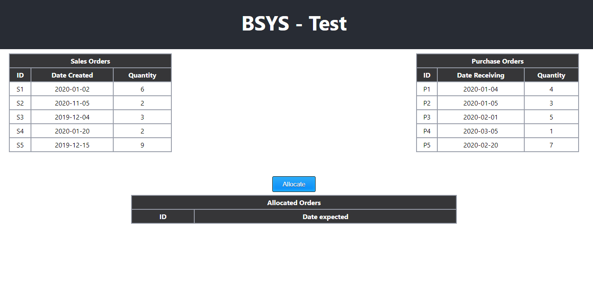
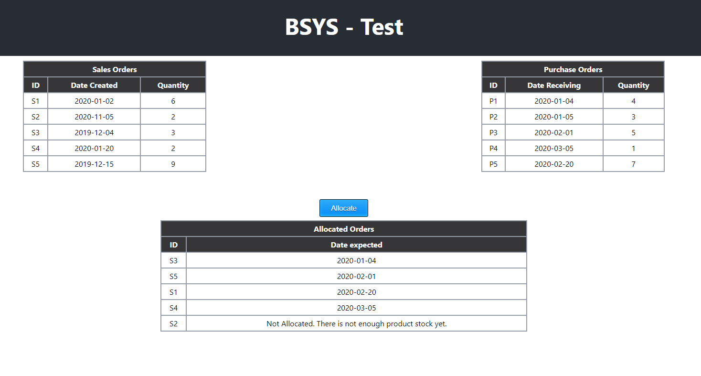

# BSYS Test
## Coding Exercise
This is a FIFO problem. We have products arriving based on supply, and then sent to customers based on demand.

* Demand is from customers.
* Supply is from the vendors.

Sales Orders are orders created by a customer for us to provide a product. This is the demand.

* 'created': when the sales order was created
* 'quantity': how many items the customer wants

Purchase Orders are orders created by us to receive a product. This is the supply.

* 'receiving': when we expect to receive the product
* 'quantity': how many we will be receiving

We want to supply the products to the customers in the order in which they were requested.


## Objectives
* Implement the function 'allocate'.
* The function should return an Array of elements. Each element should include

    * `the ID of the sales order`
    * `the date the customer should expect to get the item`

### Additional
* We only send the product once we have enough for that sales order: (so if the sales order is for 2, we need to have 2 available before sending)
* The function should support any number of sales orders or purchase orders
* To make it simple we only have one product


## Steps to execute
``` 
npm run install:all
npm run start:all
```

By doing this, a server will be executed which will be an API, and it will be listening on port 3000:

- [GET] `http://localhost:3000/v1/purchases`

- [GET] `http://localhost:3000/v1/sales`

- [GET] `http://localhost:3000/v1/supply/allocate`

Also, a page with the URL `http://localhost:8080` will automatically open.


## Functional Test
1. Load page on local browser by doing all previous commands.

2. Hit `Allocate` button and wait for reponse to be rendered on *Allocated Orders Table*.



## Unit Tests
A test with coverage report can be executed by using this command:
```
npm run test:all
```
